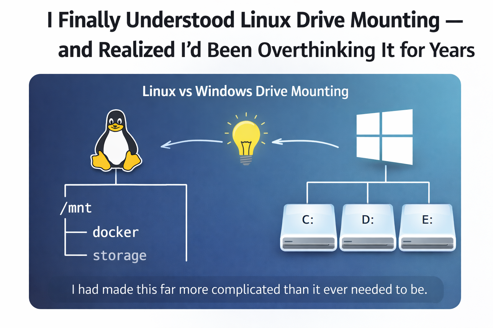

# I Finally Understood Linux Drive Mounting — and Realized I’d Been Overthinking It for Years

I recently broke my home lab.

Not in a dramatic, sparks-flying way — but in the most frustrating way possible:  
Docker containers started coming up empty. Volumes weren’t where I expected them to be. Data looked like it had vanished.

Nothing was actually lost.  
What was missing was my understanding of how Linux drive mounting really works.

And once it clicked, I realized something humbling:

> I had made this far more complicated than it ever needed to be.

---

## The Mental Model That Was Missing

Coming from a Windows background, I had always thought of storage like this:

- You plug in a drive  
- The OS gives it a letter  
- You use it  

Linux doesn’t work that way — and that difference was at the root of all my confusion.

### The key realization

**Mounting is just attaching a drive to a directory you choose.**

That’s it.

There’s no magic. No special “drive folder.”  
Just:

- Create a directory  
- Attach a drive to it  
- That directory becomes a window into the drive  

Once I understood that, everything else snapped into place.

---

## The Big “Ohhh” Moments

Here are the things I genuinely didn’t understand before — and wish I had learned years ago.

---

### 1. A directory does not mean a drive is mounted

You can create a directory anywhere in Linux:

```bash
mkdir /mnt/data
```

But unless a drive is actually mounted there, it’s just an empty folder on your main filesystem.

This was my biggest mistake.

I had directories that *looked* like drives…  
…but nothing was attached to them.

My containers were writing data — just not where I thought.

---

### 2. `/dev/sda`, `/dev/sdb`, `/dev/sdc` are not stable names

I always assumed these names were fixed.

They’re not.

Linux assigns them in the order drives are discovered at boot.  
Add a drive, remove a drive, change a cable — and the names can shift.

That’s how things like this happen:

- Yesterday: `/dev/sdb` was my data drive  
- Today: `/dev/sdb` is something else entirely  

Nothing is “wrong” — Linux is just doing what it’s designed to do.

---

### 3. This is why `/etc/fstab` exists

This was another blind spot for me.

The `/etc/fstab` file is simply Linux’s **“what should be mounted at boot”** checklist.

It answers three questions:

- Which drive?  
- Where should it appear?  
- How should it be mounted?  

The key insight:  
You don’t identify drives by name — you identify them by **UUID**.

UUIDs don’t change, even when device names do.  
That’s how Linux reliably mounts the same drive every time.

---

### 4. I accidentally made `/media` my enemy

Linux auto-mounts removable drives under `/media`.

That’s convenient — until you start mixing:

- Auto-mounted drives  
- Manually created directories  
- Docker volume paths  

I ended up with multiple directories that *looked* valid but weren’t mounted at all.

The fix was simple:

- Use `/mnt` (or `/srv`) for intentional, permanent mounts  
- Let `/media` stay automatic and temporary  

Clarity beats cleverness every time.

---

## Why This Matters (Especially for Docker)

Docker doesn’t know anything about drives.

It only knows paths.

If you tell Docker:

```text
/data/app
```

It will happily write there — even if no drive is mounted.

That means:

- You think you’re writing to a big data drive  
- You’re actually filling up your root filesystem  
- Everything looks fine… until it isn’t  

Understanding mounting turns Docker from “mysterious” into completely predictable.

---

## The Humbling Conclusion

Looking back, my real mistake wasn’t technical.

It was conceptual.

I assumed:

- Mounting was complex  
- Linux storage was fragile  
- I needed clever naming schemes to keep things straight  

The truth?

Linux mounting is simple.  
I just never learned the mental model.

Once I did:

- My system got simpler  
- My paths got cleaner  
- My confidence went way up  

And most importantly — I stopped being afraid of breaking things.

---

## If You’re New to This (or Self-Taught Like Me)

Here’s the one sentence I wish someone had told me earlier:

> **A mounted drive is just a directory that points somewhere else.**

If that clicks, you’re 80% of the way there.

Everything else is just details.
